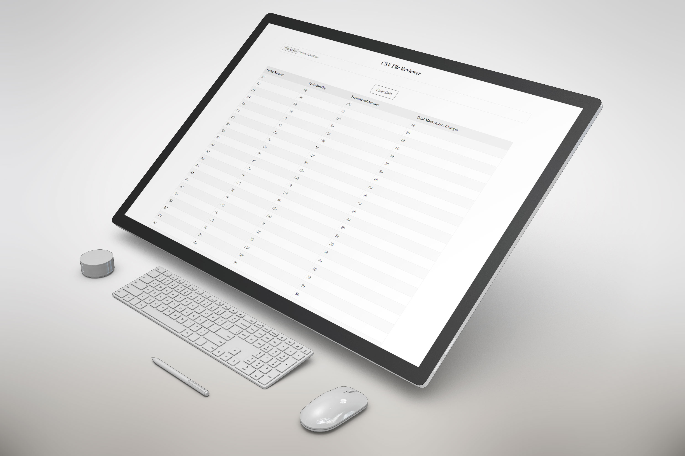

# CSV File Reviewer

A CSV (Comma-Separated Values) File Reviewer project is a tool used to review and analyze data stored in CSV files. The goal of this project is to provide an easy-to-use interface for reviewing and analyzing CSV data, making it possible for users to quickly understand and make sense of large datasets. Some common features of a CSV File Reviewer include the ability to load and preview CSV files.

## Deployed link of project
- <a href="https://sage-bombolone-1d3f78.netlify.app/"> CSV File Reviewer </a>

## Presentation Video
<ul>
  <li><a href="https://drive.google.com/file/d/1pa0WzDkfMWQXzePSlyfsOXlPcmg1487w/view?usp=share_link">Video Link</a></li>
</ul>

## Team Members

<ul>
  <li><a href="https://github.com/pratiksontakke">Pratik Sontakke</a></li>
</ul>


## Language
- JavaScript
- HTML
- CSS

## Deployment

On terminal perform:
```bash
  Open index.html with live server
```

## 🛠 Tech Stack

- JavaScript
- HTML
- CSS


## Functionality

- Reviewing and analyzing CSV data from .csv files.
- Storing data with local storage
- Clear data button

## Flow of user

- Choose .csv file 
- You can choose multiple .csv files 
- Open in CSV File Reviewer


## Presentation 





## Thank you note
Thank you all who is giving precious time to visit my little creative project which is made with lot of efforts.

